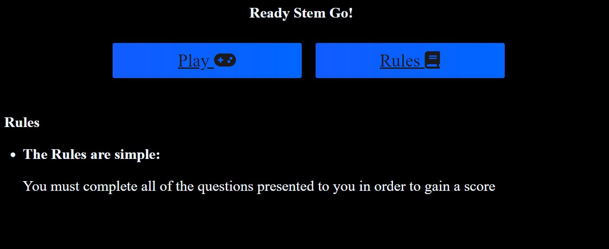

# **Ready Stem Go!**

Ready Stem Go! is an online quiz aimed to test young children and adults on their knowledge regarding STEM. 

## **Features**
- Homepage:
    - The homepage is designed to give users two options: to play or to learn the rules.
    - The heading indicates that the user will be playing a STEM based quiz.
    - The rules simply inform the user to answer all questions in order to gain a score at the end.

- Questions:
    - This quiz is composed of 4 different questions. Each question revolves around a different STEM theme. 
    - Each question comes with 4 options, all of them have the ability turn red or green depending on whether they are the correct answer. Red indicates the incorrect answer whereas green indicates the correct answer. 

- End Game:
    - At the end of the quiz, the user will be told that the game is over and then presented with a score. 
    - The users are the presented with the options to either play again or read the rules before moving forward.

