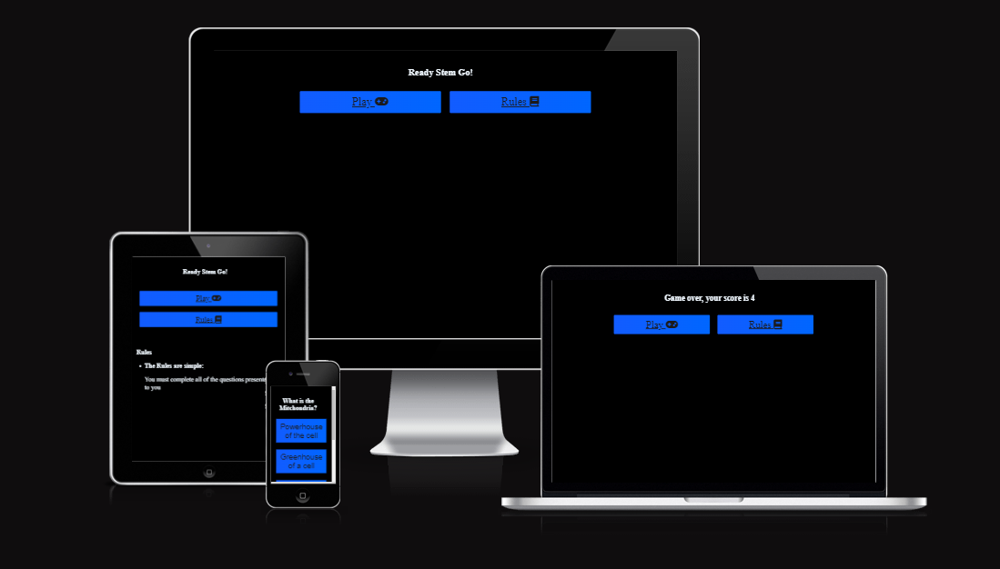

# **Ready Stem Go!**



Ready Stem Go! is an online quiz aimed to test young children and adults on their knowledge regarding STEM. 

## **Features**
- Homepage:
    - The homepage is designed to give users two options: to play or to learn the rules.
    - The note from the developer indicates that the user will be playing a STEM based quiz.
    - The rules simply inform the user to answer all questions in order to gain a score at the end.


- Questions:
    - This quiz is composed of 4 different questions. Each question revolves around a different STEM theme. 
    - Each question comes with 4 options, all of them have the ability turn red or green depending on whether they are the correct answer. Red indicates the incorrect answer whereas green indicates the correct answer. 


- End Game:
    - At the end of the quiz, the user will be told that the game is over and then presented with a score. 
    - The users are the presented with the options to either play again or read the rules before moving forward.


## **Features left to implement**
- A scoreboard that connects the user to other players online, where they can compare scores and try to gain 1st place on the leaderboard. 
- More questions, randomised, will also be implemented to avoid repetition.

## **Testing**

- I have tested this game on several different browsers: Chrome, Opera GX and Microsoft Edge. 
- I confirm that the game results are always correct
- I confirm that all of the elements are readable and function as intended. 
- I confirm that the webpage is easy to read and accessible by running it through lighthouse in devtools:


- I confirm that the page is responsive and functional on all screensizes using the features inside devtools.

## **Bugs**

- One of the few bugs that appeared within this project was to with the responsive element. The webpage would drastically change whenever the screensize did. In order to combat this, I implemented the code below into the CSS which enabled it to become responsive:  

```
* {
    box-sizing: border-box;
  }
  
  .row::after {
    content: "";
    clear: both;
    display: table;
  }
  
  [class*="col-"] {
    float: left;
    padding: 15px;
  }
  
.col-1 {width: 8.33%;}
.col-2 {width: 16.66%;}
.col-3 {width: 25%;}
.col-4 {width: 33.33%;}
.col-5 {width: 41.66%;}
.col-6 {width: 50%;}
.col-7 {width: 58.33%;}
.col-8 {width: 66.66%;}
.col-9 {width: 75%;}
.col-10 {width: 83.33%;}
.col-11 {width: 91.66%;}
.col-12 {width: 100%;}

@media only screen and (max-width: 768px) {

  /* For mobile phones: */
  [class*="col-"] {
    width: 100%;
  }
}

.hide{
    display: none;
}
```
- Another bug was found within the JavaScript code when trying to pass it through the validator: 

By using my own initiative and with some help from ChatGpt, I was able to rewrite the code slightly so that the error was fixed. 

## **Validator Testing**
- HTML:
    - No errors were returned when pass the code through the official W3C validator
- CSS:
    - No errors were found when passing the code through the official (Jigsaw) validator
- JavaScript:
    - No errors were found when passign code through the official JSHint JavaScript Validator 

## **Unfixed Bugs**
- No unfixed bugs

## **Deployment**

- 


